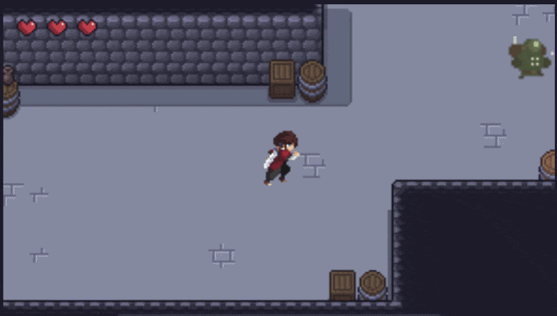

# Emotion Express

> Videojuego 2D en el navegador que usa **reconocimiento facial de emociones** para decidir a qué nivel juegas a continuación.

**Emotion Express** (motor de IA *EmotionNetV3*) es un juego de acción/aventura hecho con HTML5 Canvas y JavaScript puro. Combina las mecánicas clásicas de un juego de mazmorras (moverte, atacar y superar niveles eliminando enemigos) con un modelo de **TensorFlow.js** que analiza tu cara mediante la webcam en tiempo real. La emoción que predomina mientras juegas determina el siguiente nivel al que accedes.

**[DEMO](https://emotion-express.netlify.app/)**

<p align="center">
  
</p>

---

## Características
- **Motor de juego propio** en JavaScript sobre HTML5 Canvas (sin frameworks de juego).
- **Reconocimiento facial de emociones** con TensorFlow.js: detecta *neutral, felicidad, tristeza, enfado, sorpresa y miedo*.
- **Niveles adaptativos**: la emoción predominante decide el próximo nivel.
- **5 niveles** construidos con tilesets por capas (suelo, paredes y decoración).
- **3 tipos de enemigos** (Bot, Skeleton y Stormhead) con IA básica de persecución y sprites animados.
- **Combate y sistema de vida**: ataques con hitbox, corazones e invulnerabilidad tras recibir daño.
- **Vista previa de la cámara** activable para centrar tu rostro.

---

## Controles
| Tecla     | Acción                        |
|-----------|-------------------------------|
| `W A S D` | Moverse                       |
| `Espacio` | Atacar                        |
| `E`       | Abrir puertas (avanzar nivel) |
| `M`       | Activar / desactivar modo IA  |
| `C`       | Mostrar / ocultar la cámara   |

**Objetivo:** elimina a todos los enemigos del nivel, colócate sobre la puerta y pulsa `E` para avanzar. Con el modo IA activo, tu emoción decide el nivel siguiente; si está desactivado, avanzas al siguiente de forma normal.

---

## Tecnologías
- **HTML5 Canvas**: renderizado gráfico
- **JavaScript (ES6+)**: motor y lógica del juego
- **TensorFlow.js 2.0**: inferencia del modelo de emociones en el navegador
- **WebRTC (`getUserMedia`)**: acceso a la webcam
- **GSAP**: animaciones de la interfaz

---

## Ejecutar en local
El juego necesita un servidor web (la cámara y el modelo de IA no funcionan abriendo el `index.html` directamente).

```bash
# Clona el repositorio
git clone https://github.com/zoraizmahmood/Emotion-Express.git
cd Emotion-Express

# Levanta un servidor local (elige una opción)
python -m http.server 8000        # Python 3
# npx serve                        # Node.js
```

Luego abre `http://localhost:8000` en tu navegador y permite el acceso a la cámara.

> Navegadores recomendados: Chrome 80+, Firefox 75+ o Safari 13+. Para desplegarlo en producción se requiere **HTTPS** para poder usar la cámara.

---
## Estructura del proyecto

```
Emotion-Express/
├── index.html          # Página principal
├── js/
│   ├── index.js        # Motor principal y game loop
│   ├── emotionNet.js   # Cámara + modelo de IA de emociones
│   ├── eventListeners.js
│   └── utils.js
├── classes/            # Player, colisiones, puertas, vida y enemigos
├── data/               # Capas de los niveles (suelo, paredes, decoración)
├── modelo/, modelo_max/  # Modelos de IA entrenados (TensorFlow.js)
├── images/, playerAssets/, MonstersAssets/, utilsAssets/  # Sprites y tilesets
└── README.md
```
---

## Contexto
Proyecto desarrollado en el marco de un **Treball de Recerca (TR)** como demostración práctica del uso de inteligencia artificial aplicada al entretenimiento.

## Autor
Creado por [zoraizmahmood](https://github.com/zoraizmahmood).